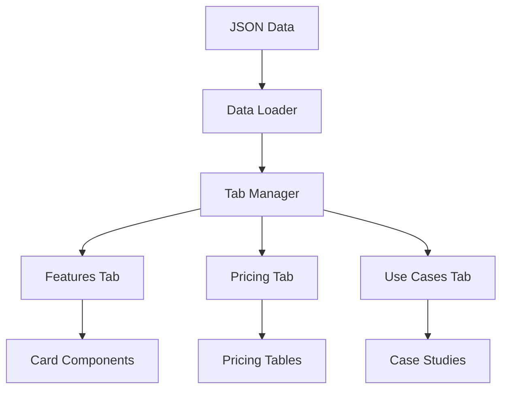

# Finalized JSON Data Display Enhancement Plan

## Implementation Summary

- **Objective**: Display 100% of JSON data while improving UX
- **Components**:
  - Tabbed interface (Features, Pricing, Use Cases)
  - Expandable content cards
  - Responsive design
  - Performance optimizations

## Technical Specifications

### Core Architecture



### File Structure

```
website/
  js/
    tool-details/
      core.js       # Tab system & core logic
      features.js   # Features tab components
      pricing.js    # Pricing tab components
      cases.js      # Use cases components
  css/
    tool-details/   # Component-specific styles
```

## Implementation Timeline

### Core Framework

- [ ] Tab system scaffolding
- [ ] Base CSS grid layout
- [ ] Accessibility foundations
- [ ] Basic data binding

### Content Implementation

- [ ] Features tab with expandable cards
- [ ] Pricing breakdown tables
- [ ] Interactive use cases
- [ ] Error states & empty data handling

### Enhancements

- [ ] Loading skeletons
- [ ] Print styles
- [ ] Performance optimizations
- [ ] Final testing

## Quality Assurance

1. **Browser Testing**:

   - Chrome, Firefox, Safari, Edge
   - Mobile & desktop views

2. **Performance Metrics**:

   - Largest Contentful Paint < 1.5s
   - CLS < 0.1
   - Memory usage < 50MB

3. **Accessibility**:
   - WCAG AA compliance
   - Keyboard navigation
   - Screen reader testing
