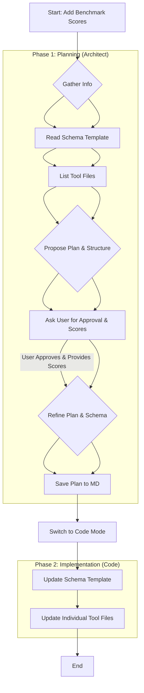

# Plan: Add Benchmark Scores to AI Tool JSON Files

This plan outlines the steps to add a `benchmark_scores` section to the AI tool JSON schema and update the corresponding tool data files.

**Phase 1: Planning (Architect Mode)**

1.  **Gather Information:**
    - Read the existing schema template (`ai_tools_resource/data/ai_tool_schema_template.json`).
    - List the AI tool JSON files in `ai_tools_resource/data/`.
2.  **Define Schema Update:**
    - Propose a structure for the new `benchmark_scores` section.
    - **Final Structure (allowing strings for flexibility):**
      ```json
          "benchmark_scores": {
            "type": "object",
            "description": "Standardized benchmark test scores for the tool. Scale and interpretation (e.g., higher is better, 0-100) should be documented separately.",
            "properties": {
              "overall_performance": { "type": ["number", "string"], "description": "Composite score representing overall benchmark performance (numeric or descriptive)." },
              "accuracy": { "type": ["number", "string"], "description": "Benchmark score for accuracy (numeric or descriptive)." },
              "speed": { "type": ["number", "string"], "description": "Benchmark score for processing speed (numeric or descriptive, e.g., 'real-time')." },
              "task_specific": {
                "type": "object",
                "description": "Scores for specific benchmark tasks relevant to the tool's category.",
                "additionalProperties": { "type": ["number", "string"] }
              }
            },
            "required": ["overall_performance"] // Inner requirement
          },
      ```
3.  **Confirm Requirements & Receive Scores:**
    - Confirm with the user:
      - Approval of the schema structure.
      - Decision to make `benchmark_scores` mandatory at the top level for this update. Acknowledged that future edge cases might require schema revision later.
      - Importance of documenting score interpretation (scale, meaning) separately.
    - Receive the benchmark scores provided by the user for the 24 identified tool files.
4.  **Finalize Plan:** Document the plan (this file).

**Phase 2: Implementation (Code Mode)**

5.  **Update Schema File:** Modify `ai_tools_resource/data/ai_tool_schema_template.json` using `apply_diff` or `insert_content`:
    - Insert the `benchmark_scores` definition into the `properties` object.
    - Add `"benchmark_scores"` to the top-level `required` array.
6.  **Update Tool Files:** Iterate through the 24 tool JSON files (`adobe_firefly.json`, `amazon_codewhisperer.json`, etc.) using `apply_diff` or `insert_content`:
    - Insert the `benchmark_scores` section with the corresponding data provided by the user into each file.

**Identified Tool Files (24):**

- `adobe_firefly.json`
- `amazon_codewhisperer.json`
- `amazon_comprehend.json`
- `amazon_lex.json`
- `amazon_rekognition.json`
- `azure_ai_language.json`
- `claude_anthropic.json`
- `cohere_ai.json`
- `dialogflow.json`
- `gemini_google.json`
- `google_cloud_nlp.json`
- `huggingface.json`
- `ibm_watson_nlu.json`
- `leonardo_ai.json`
- `llama_meta.json`
- `midjourney.json`
- `monkeylearn.json`
- `nltk.json`
- `openai_api.json`
- `runwayml.json`
- `spacy.json`
- `stable_diffusion.json`
- `stanford_corenlp.json`
- `wit_ai.json`

**Plan Visualization:**



**Next Steps:**

1.  Save this plan.
2.  Request switch to Code mode for implementation.
